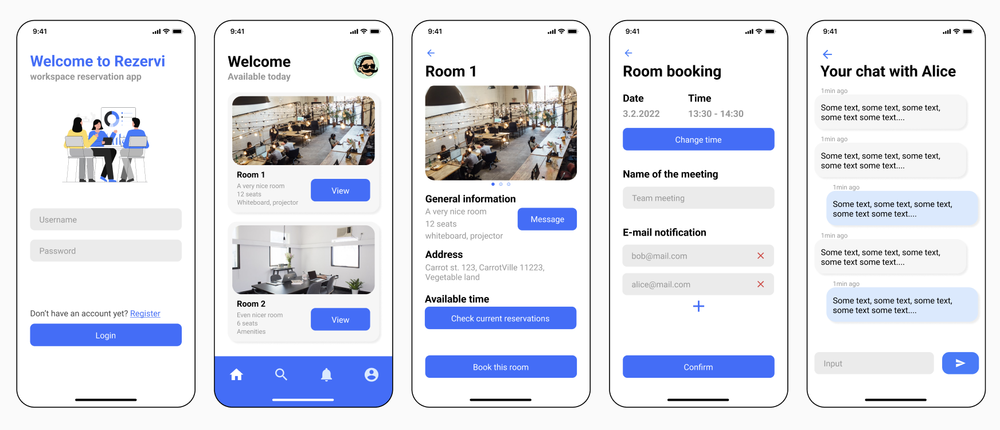

# frontend
Frontend for our workspace reservation app made with (Expo)[https://expo.dev].

This mobile app allows users to:
- View, create, and edit room reservations: Users can browse available rooms, book them, and make changes to existing reservations.
- Create new room listings: Room owners can add new rooms to the system, providing details such as availability, pricing, and amenities.
- Custom chat service: A real-time messaging feature (based on WebSockets), which enables direct communication between users and room owners.

